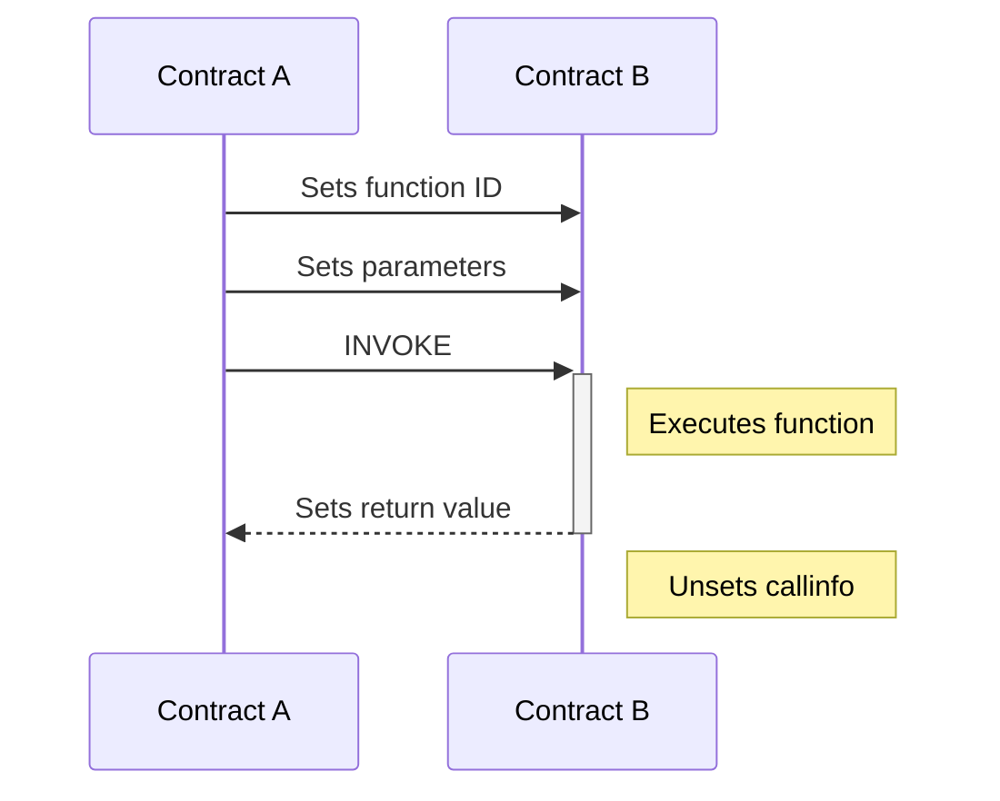

### std01

**Smart Contract Interfaces**

*(Draft)*

*Overview*\
In this standard, std01, we define the structures and mechanisms necessary for interacting with smart contracts via function-based interfaces.

*Protocol*\
When a given smart contract (Contract A) wishes to call a function of another contract (Contract B), it sets data in its state to indicate:
1. Which function should be called,
2. What should be sent to the function as parameters, and
3. Where the return value should be sent

*Definitions*\
`func_id_loc`: The state at local location `0x01000` within Contract B's owned state.\
`param_loc_range`: The set of local locations `0x01001` through `0x01ffe` within Contract B's owned state.
`return_loc`: The state at local location `0x01fff` within Contract B's owned state.
`callinfo`: The set of buffers in state with locations specified in `func_id_loc`, `param_loc_range`, or `return_loc_loc`.

*Sets function ID*\
When Contract A wishes to select which function to call on Contract B, it must set a value within the state that Contract B owns at `func_id_loc`. This value must correspond with the ID of the function Contract A intends to execute. IDs are chosen by the creator of a smart contract, and should be listed in a description of its interface details, if applicable. IDs should be unique, meaning there should be no two functions on the Polycash blockchain that share an ID. If this protocol is followed, interactions with smart contracts with an incorrect contract address will fail in a manner that is easier to track; checking if a call was made to the wrong function is quite simple if the error is consistent, being represented by a missing function ID.

*Sets parameters*\
Contract A may send arbitrary data to Contract B via a set of buffers, each representing a discrete 'parameter'. These buffers, stored in the PVM's state, must be in the set of local locations that are members of `param_loc_range`. Each buffer has an unlimited size and may be used to pass any data needed from Contract A to Contract B.

*INVOKE*\
In this step, Contract A uses the `Invoke` instruction to call Contract B. Then, Contract B reads the function ID and jumps to the corresponding section of its code. If needed, it can read from the buffers in `param_loc_range` to access the parameters its function was called with. After execution is finished, Contract B writes its output into local state at `return_loc`. After the operation is completed, it sets the buffers in `callinfo` to the ESWV.
